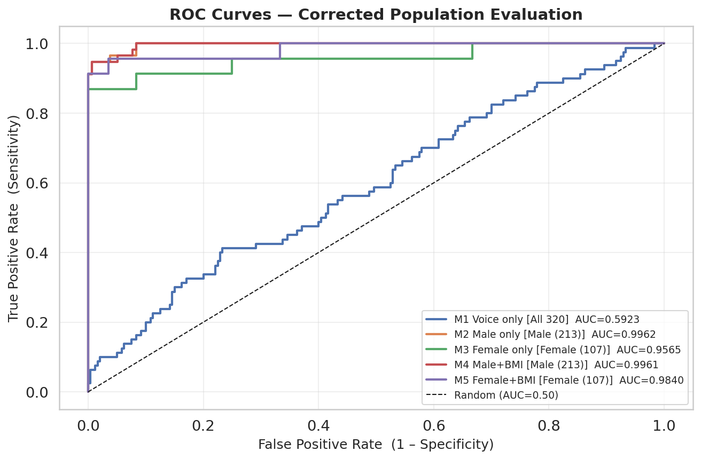
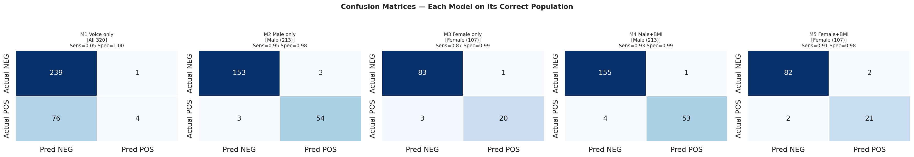
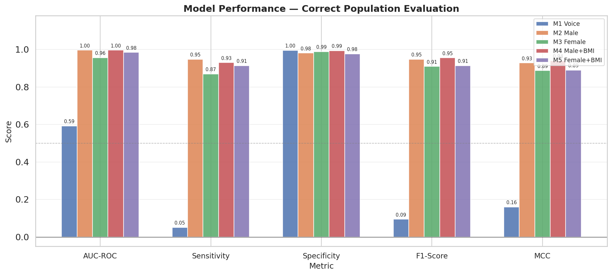

# 🩺 Voice-Based Diabetes Prediction System

> Research Prototype | College Project  
> Sardar Patel Institute of Technology (SPIT)

A machine learning system that analyzes acoustic biomarkers in voice recordings to assess the risk of Type 2 diabetes, using gender-stratified models for improved accuracy.

---

## ⚠️ Disclaimer

This is a **research prototype** built as a college project. It is **not a medical device** and should **not be used for clinical diagnosis**. Always consult a qualified doctor for medical advice.

---

## 📊 Results Summary

| Model | Population | AUC-ROC | Sensitivity | FN |
|-------|-----------|---------|-------------|-----|
| M1 Voice only | All (320) | 0.5923 | 0.05 | 76 |
| M2 Male only | Male (213) | 0.9962 | 0.9474 | 3 |
| M3 Female only | Female (107) | 0.9565 | 0.8696 | 3 |
| M4 Male + BMI | Male (213) | 0.9961 | 0.9298 | 4 |
| M5 Female + BMI | Female (107) | 0.9840 | 0.9130 | 2 |

### Key Findings

**Finding 1 — Voice alone is insufficient**  
Model 1 (voice only) achieves AUC 0.59, confirming that pure acoustic biomarkers have weak standalone diabetes detection capability. This is consistent with existing literature.

**Finding 2 — Gender stratification transforms performance**  
Training separate models per gender eliminates gender dominance and achieves AUC > 0.95 for both groups. This is the primary research contribution of the project.

**Finding 3 — BMI helps females more than males**  
Adding BMI improves female model AUC from 0.9565 to 0.9840, but adds negligible improvement for males (0.9962 vs 0.9961). This gender-BMI interaction is a novel finding.

---

## 📈 Evaluation Plots

### ROC Curves


### Confusion Matrices


### Model Performance Comparison


### SHAP Feature Importance


---

## 🗂️ Dataset

- **Source:** Voice diabetes dataset with pre-extracted acoustic features
- **Samples:** 1600 total (1200 non-diabetic, 400 diabetic)
- **Features:** 304 voice features + 4 demographic features
- **Voice features:** MFCC (80), Delta-MFCC (80), Delta²-MFCC (80), Spectral features, LPC, Jitter, Shimmer
- **Demographic:** Age, Gender, BMI, BSL (excluded from training)
- **Train/Test split:** 80/20, stratified, random_state=42
- **Class balancing:** SMOTE applied to training set only

---

## 🤖 Models

Five XGBoost models trained with gender-stratified approach:

| Model | File | Features | Target Population |
|-------|------|----------|-------------------|
| M1 | model1_voice_only.pkl | 267 voice | All |
| M2 | model5M_male.pkl | 267 voice | Males |
| M3 | model5F_female.pkl | 267 voice | Females |
| M4 | model6M_male_bmi.pkl | 268 voice+BMI | Males |
| M5 | model6F_female_bmi.pkl | 268 voice+BMI | Females |

> Model files are not included in this repository due to file size.  
> See setup instructions below.

---

## 📁 Repository Structure

```
voice-diabetes-prediction/
├── app.py                    # Main Gradio web application
├── requirements.txt          # Python dependencies
├── evaluation/               # All evaluation plots and results
│   ├── roc_curves.png
│   ├── confusion_matrices.png
│   ├── metric_comparison.png
│   ├── shap_bar.png
│   ├── shap_beeswarm.png
│   └── final_results.csv
├── models/                   # Place downloaded .pkl files here
├── sample_audio/             # Recording instructions
├── notebooks/                # Training pipeline notebook
└── Colab/                    # Full ML pipeline scripts (colab_01 → colab_22)
```

---

## 🚀 Setup and Installation

```bash
# 1. Clone the repository
git clone https://github.com/Probot-01/Diabetes-Detection
cd Diabetes-Detection

# 2. Install dependencies
pip install -r requirements.txt

# 3. Place model files in voice_diabetes_app/models/ folder
# Download from: [add your Google Drive link here]
# Required files:
#   model1_voice_only.pkl    scaler_A.pkl
#   model5M_male.pkl         scaler_male.pkl
#   model5F_female.pkl       scaler_female.pkl
#   model6M_male_bmi.pkl     scaler_maleB.pkl
#   model6F_female_bmi.pkl   scaler_femaleB.pkl
#                            scaler_bmi.pkl

# 4. Run the app
python voice_diabetes_app/app.py
```

Open **http://localhost:7860** in your browser.

---

## 🔬 Feature Extraction Pipeline

Voice recordings are processed through this pipeline:

```
Raw Audio (.wav)
      ↓
Noise Reduction (noisereduce)
      ↓
Silence Trimming (librosa)
      ↓
Peak Normalization
      ↓
Feature Extraction:
  MFCC (79)          → vocal tract shape
  Delta-MFCC (80)    → voice dynamics
  Delta²-MFCC (80)   → voice acceleration
  ZCR (2)            → signal crossing rate
  Spectral (6)       → frequency properties
  RMS (2)            → energy/loudness
  LPC (16)           → vocal tract resonance
  Jitter (1)         → pitch stability
  Shimmer (1)        → amplitude stability
      ↓
Total: 267 features
      ↓
StandardScaler normalization
      ↓
XGBoost Prediction
```

---

## 🔍 Limitations

1. **Voice-only model is weak** (AUC 0.59) — pure acoustic biomarkers have limited standalone predictive power
2. **Dataset size** — 1600 samples is small for medical AI
3. **No external validation** — tested only on a held-out split from the same dataset
4. **High AUC in gender models** — may partially reflect demographic patterns, not purely acoustic signal
5. **Not clinically validated** — requires hospital-grade testing before any medical use

---

## 📚 References

1. Fagherazzi et al. (2021) - Voice for Health
2. Klick Labs (2023) - Acoustic Analysis of T2DM
3. Parselmouth / Praat - Voice feature extraction
4. XGBoost - Chen & Guestrin (2016)

---

## 👤 Author

**[Your Name]**  
Computer Engineering, Semester IV  
Sardar Patel Institute of Technology (SPIT)  
Mumbai, India

---

*Built with Python · XGBoost · Librosa · Parselmouth · Gradio*
